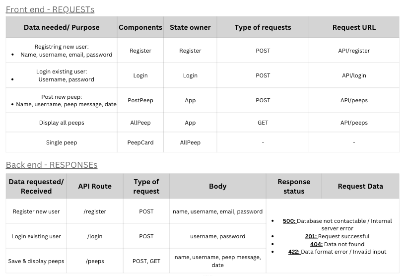

Chitter Challenge
=================
### Getting started - *dependencies installed*:
---
#### **Client side**:
- `npx create-react-app` - to create React application
- `npm install` - to install all dependencies
- `npm install -g json-server` - to install JSON server
- `npm i axios dotenv` - use axios to obtain data from JSON server
- `npm i --save react-router-dom@latest` - install react router

#### **Server side**:
- `npm init` - to initialise folder as npm project
- `npm i -g nodemon` - allows edits without having to stop & start application over again
- `npm install --save express dotenv` - to setup Express web application framework to build a basic web server && install dotenv for environmental variable loading
- `npm i --save-dev mocha` - Mocha testing framework
- `npm i --save-dev chai chai-http` - extended assertion library with http integration
- `npm i cors` - cross origin resource sharing npm package
- `npm i body-parser` - creates middleware for handling json req.body
- `npm i mongoose` - Mongoose provide interaction between server & MongoDB
- `npm i --save express-validator` - for sanitization

## Component Hierachy
---
### Login Page

| Components   | Colour                                     |
| ------------ | ------------------------------------------ |
| **Header**   | Green    |
| **AllPeeps** | Dark blue |
| **PeepCard** | Red        |
| **Login**    | Orange  |
| **Footer**   | Green    |
---
### Register Page

| Components   | Colour                                   |
| ------------ | ---------------------------------------- |
| **Header**   | Green  |
| **Register** | Pink |
| **Footer**   | Green  |
---
### User Page

| Components   | Colour                                           |
| ------------ | ------------------------------------------------ |
| **Header**   | Green          |
| **PostPeep** | Light blue |
| **AllPeeps** | Dark blue       |
| **PeepCard** | Red              |
| **Footer**   | Green          |
---
### Overview Table
